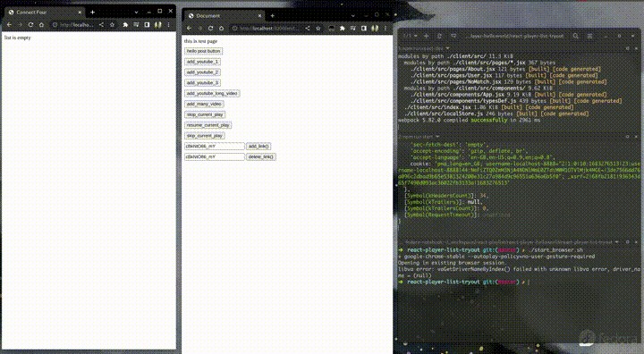

### development environment

#### start development

```bash
# start react auto-refreshing
$ npm run react-dev


# start express server
$ npm run start

# a switch to the browser is required, start with following shell-script
$ ./start_browser.sh

# browse video player -> http://localhost:3000/
# browse testing page -> http://localhost:3000/test
```

### demo


[source](./gifs/screen1.webm)

### references
- https://github.com/ConSol/docker-headless-vnc-container
